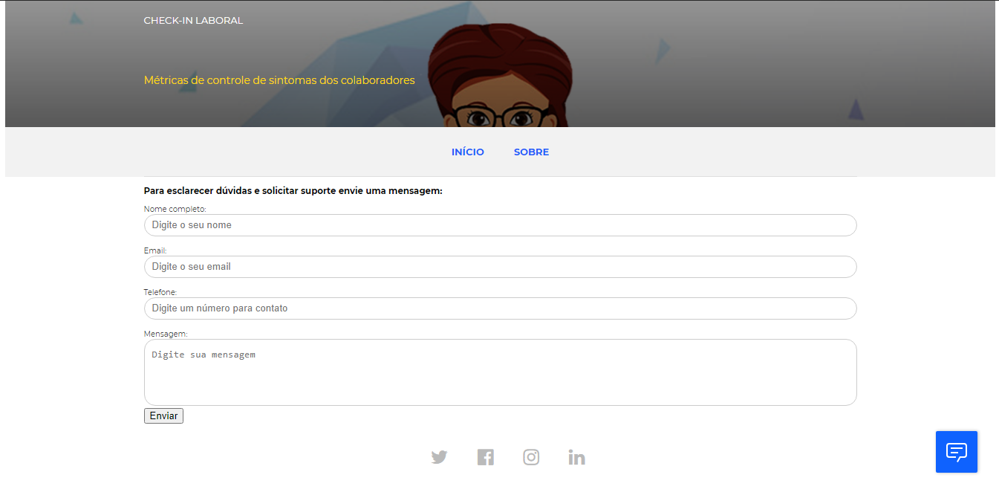
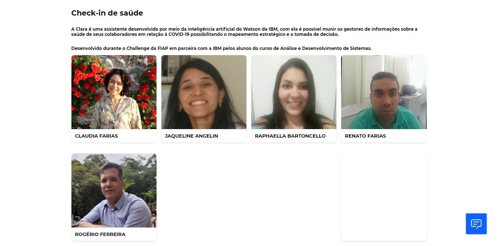

<h1>Clara Assistente</h1>

<h2>Aplicação</h2>

Site de apoio à empresa ao mapeamento de sintomas da COVID-19 em seus colaboradores

Preview: 👉 <a href="claraassistent.github.io">Clara</a>

<h2>Utilizados</h2>
<ul>
<li>IBM Watson</li>
<li>HTML5</li>
<li>CSS3</li>
<li>Google Fonts</li>
<li>Fontawesome</li>
</ul>

<h2>Layout</h2>

